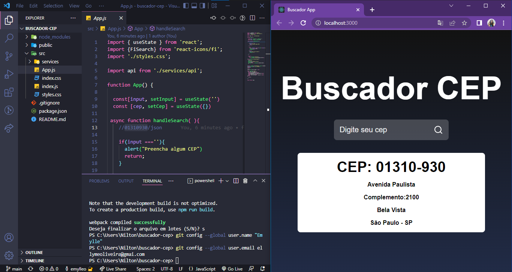

# Buscador de CEP

_interface de busca com ReactJS e JavaScrip, consumindo API pelo axios, para receber dados estruturados em um JSON provido por um serviço web._

BUSCADOR FRONTEND INÍCIO |
:-------------------------:|
|

## Requirements

  - [x] Layout basico utilizando CSS;
  - [x] Consumindo API por Axios;
  - [x] Uso de Object Keys;

## Instalação da Aplicação

>_Para instalar Buscador:_

```
npm install
```

>_Para rodar a aplicação_

```
npm start
```

## Aquitetura da Aplicação

`axios`: Ficou responsável pelo consumo da “API”.

> OBS: a API fornecida tem todos os campos iguais e sem algum `id` de referencia, que ajudaria a tratar o código melhor. Porém o código foi arquitetado, para que se viesse com funções diferentes modificasse o layout.
